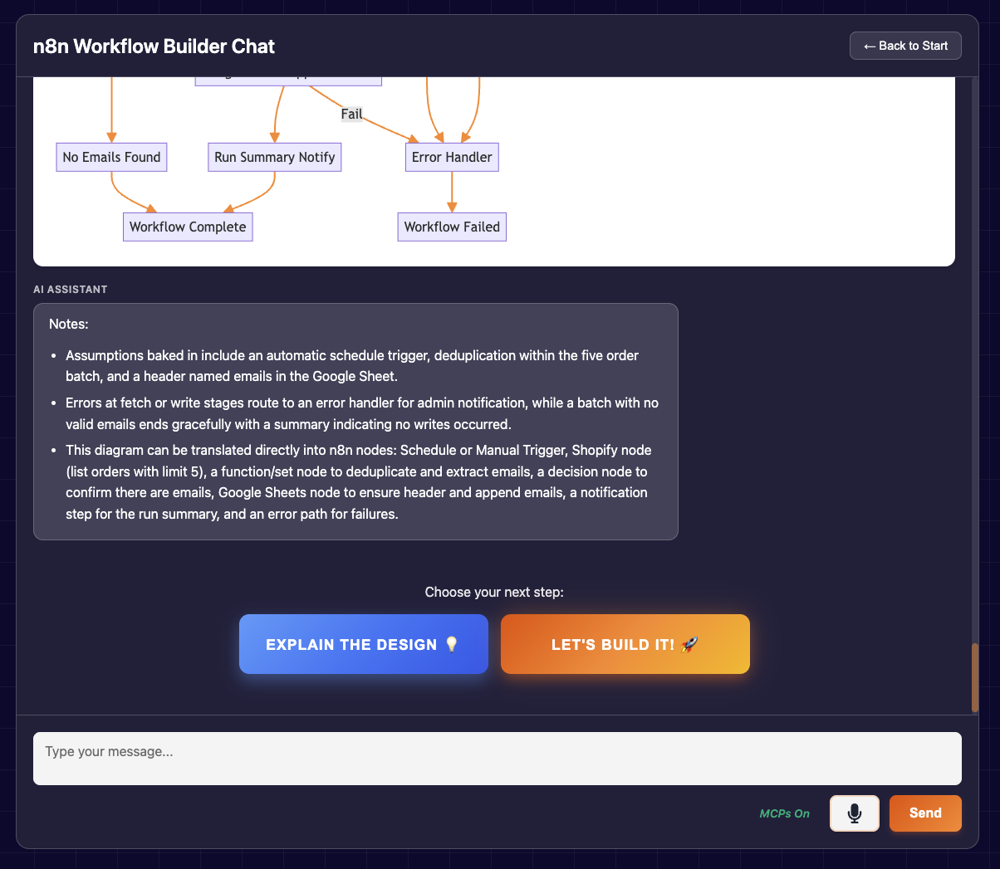

# n8n Workflow Builder - AI-Powered Automation Assistant

An interactive web application that helps users plan and design n8n automation workflows using AI-powered conversation, visual Mermaid diagrams, and voice input. The app generates production-ready n8n JSON workflows through a guided multi-stage conversation.

## Features

- **Multi-Stage Conversation Flow**: Guided workflow design from initial concept → clarifications → diagram → JSON
- **Dual AI Models**: GPT-5 Nano for chat, Claude Sonnet 4.5 for n8n JSON generation
- **MCP Integration** (optional): Model Context Protocol for n8n-mcp tools and Context7 documentation access
- **Visual Workflow Diagrams**: Auto-generated Mermaid diagrams with syntax error recovery
- **Voice Input**: Deepgram Nova-3 integration via WebSocket proxy
- **Educational Explanations**: First-person design rationale for learning n8n best practices
- **Retry & Recovery**: Automatic retry logic for API failures and diagram syntax errors
- **Secure Proxy Architecture**: Server-side API key management with no client exposure

## Quick Start

### 1. Configure Environment Variables

Copy `.env.example` to `.env` and add your API keys:

```bash
cp .env.example .env
```

Edit `.env` with your actual keys:
```bash
OPENAI_API_KEY=sk-...
ANTHROPIC_API_KEY=sk-ant-...
DEEPGRAM_API_KEY=...  # Optional, for voice input
SUPABASE_URL=...       # Optional, for analytics
SUPABASE_ANON_KEY=...  # Optional, for analytics
PORT=8099              # Default: 8099
```

### 2. Install Dependencies

```bash
cd workflow-planner
npm install
```

### 3. Start the Proxy Server

The proxy server handles API authentication and proxies requests securely:

```bash
cd workflow-planner
node proxy-server.js
```

Server will start on `http://localhost:8099`

### 4. Open Your Browser

Navigate to http://localhost:8099

### 5. Start Building Workflows

Type your automation idea or click a suggestion button. The app will guide you through the workflow design process.

## How It Works



### Multi-Stage Workflow Design Process

1. **Initial Consultation** (`initial` stage)  
   Tell the AI what you want to automate

2. **Clarification** (`clarifying` stage)  
   The AI asks 2-3 targeted questions about systems, APIs, volumes, and processes

3. **Design Proposal** (`design_proposed` stage)  
   Receive a text-based workflow design with key steps and decision points

4. **Visual Diagram** (`diagram_generated` stage)  
   Click "Diagram it!" to generate a Mermaid flowchart visualization

5. **Optional Explanation** (`explanation` stage)  
   Request a first-person explanation of design decisions and n8n best practices

6. **JSON Generation** (`building` stage)  
   Click "Let's Build It!" to generate production-ready n8n workflow JSON with Claude Sonnet 4.5

7. **Download & Import** (`complete` stage)  
   Download the timestamped JSON file and import directly into your n8n instance via **Workflows → Import from File**

## Example Prompts

- "I want to automate lead nurturing for real estate"
- "Help me build an invoice processing pipeline"
- "Create a workflow for daily AI news digest"
- "I need to automate customer support ticket routing"

## Architecture

### Two-File System

The application uses a dual-file architecture to isolate MCP (Model Context Protocol) functionality:

- **`app-original.js`**: Clean version without MCP, `useMcpTools: false` hardcoded
- **`app-mcp.js`**: MCP-enabled version with n8n-mcp and Context7 tool access

The `index.html` dynamically loads the appropriate script based on the MCP toggle state, with full state preservation across switches.

### Proxy Server (`proxy-server.js`)

Secure Node.js/Express server that:
- Manages API keys server-side (never exposed to client)
- Proxies OpenAI, Claude, and Deepgram API requests
- Handles MCP tool execution and formatting
- Provides WebSocket proxy for Deepgram voice streaming
- Serves static files with cache control
- Optional Supabase integration for analytics

### AI Models

- **GPT-5 Nano (2025-08-07)**: Conversational planning, clarifications, design proposals
- **Claude Sonnet 4.5**: n8n workflow JSON generation with strict output formatting
- **Deepgram Nova-3**: Real-time voice transcription via WebSocket (optional)

### MCP Integration (Optional)

When MCP mode is enabled:
- **n8n-mcp tools**: `search_nodes`, `get_node`, `validate_workflow`
- **Context7**: Library documentation and implementation guidance
- **Tool calling**: OpenAI native function calling with formatted plain-text results
- **Timeouts**: 1500ms for chat, 3000ms for build phase

## Technologies Used

### Frontend
- HTML5, CSS3, Vanilla JavaScript (ES2020+)
- Mermaid.js v10+ for diagram rendering
- marked.js for Markdown parsing
- domtoimage for diagram PNG export
- MediaRecorder API for voice capture

### Backend
- Node.js with native `http`/`https` modules
- WebSocket (`ws`) for Deepgram proxy
- `@supabase/supabase-js` for optional analytics
- `@modelcontextprotocol/sdk` for MCP integration

### AI Services
- OpenAI API (GPT-5 Nano)
- Anthropic API (Claude Sonnet 4.5)
- Deepgram API (Nova-3 STT)

## Browser Support

Requires modern browsers with:
- WebSocket support (for voice input)
- ES2020+ JavaScript features
- Fetch API with AbortController

Tested on:
- Chrome 90+
- Firefox 88+
- Safari 14+
- Edge 90+

## Docker Deployment

A `Dockerfile` and `docker-compose.yml` are provided for containerized deployment:

```bash
# Build and run
docker compose up -d

# View logs
docker compose logs -f

# Stop
docker compose down
```

Environment variables are passed through from your `.env` file.

## Development

### Project Structure

```
workflow-planner/
├── index.html           # Main HTML with MCP toggle logic
├── app-original.js      # Non-MCP version (~1985 lines)
├── app-mcp.js          # MCP-enabled version (~2800 lines)
├── proxy-server.js     # Node.js proxy server (~1205 lines)
├── config.js           # Client config (keys now server-side)
├── styles.css          # UI styling
├── api/
│   └── mcp-client.mjs  # MCP SDK integration
└── package.json        # Dependencies
```

### Making Changes

1. **Logic changes**: Edit `app-original.js` and/or `app-mcp.js`
2. **Proxy/API changes**: Edit `proxy-server.js`
3. **Styling**: Edit `styles.css`
4. **Structure**: Edit `index.html`

Restart `proxy-server.js` after server-side changes. Client-side changes require browser refresh.

### Security Considerations

- API keys are **never** exposed to the browser
- All AI requests go through the proxy server
- `.env` file is blocked by proxy with 403 Forbidden
- See `CODE-REVIEW.md` for security audit results
- See `SECURITY-REFACTOR-PLAN.md` for recommended hardening steps

## Known Limitations

- No authentication/rate limiting on proxy endpoints
- Mermaid diagram syntax can fail with special characters (auto-retry in place)
- Voice input requires Deepgram API key with Member role
- MCP tools require proxy server running on same host

## Documentation

- **PROJECT-SUMMARY.md**: Comprehensive project documentation

## License

MIT
